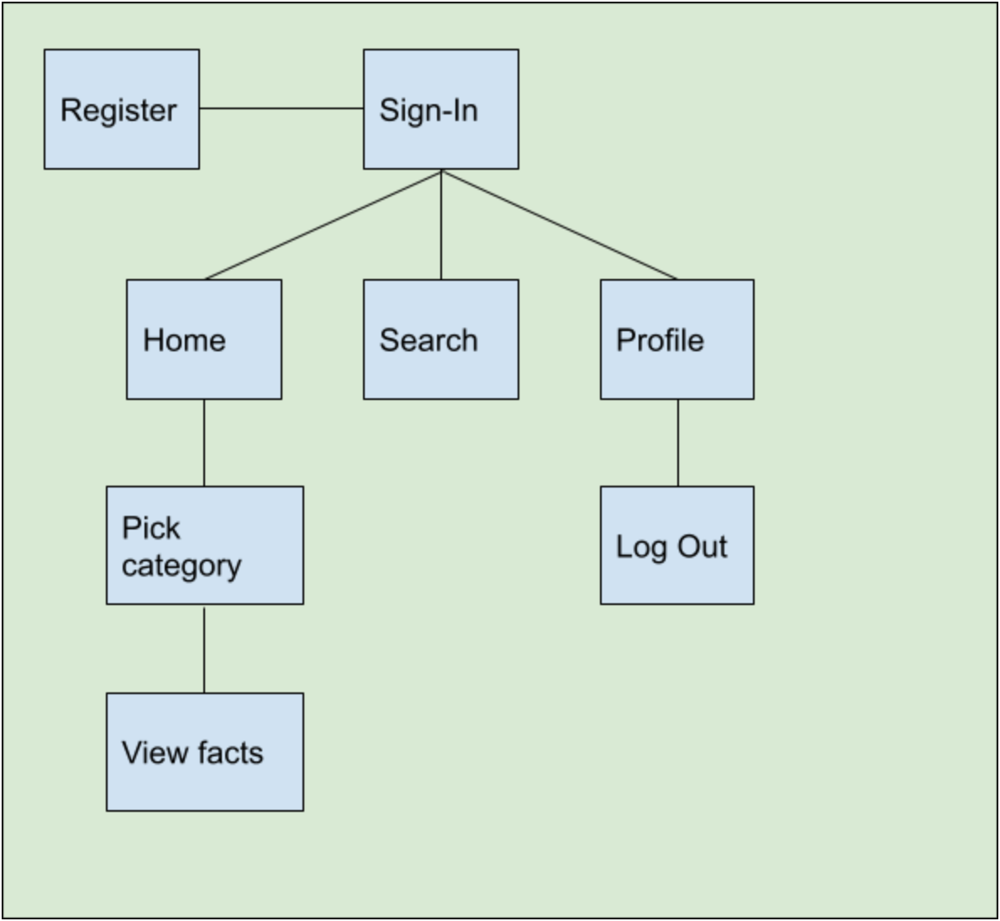
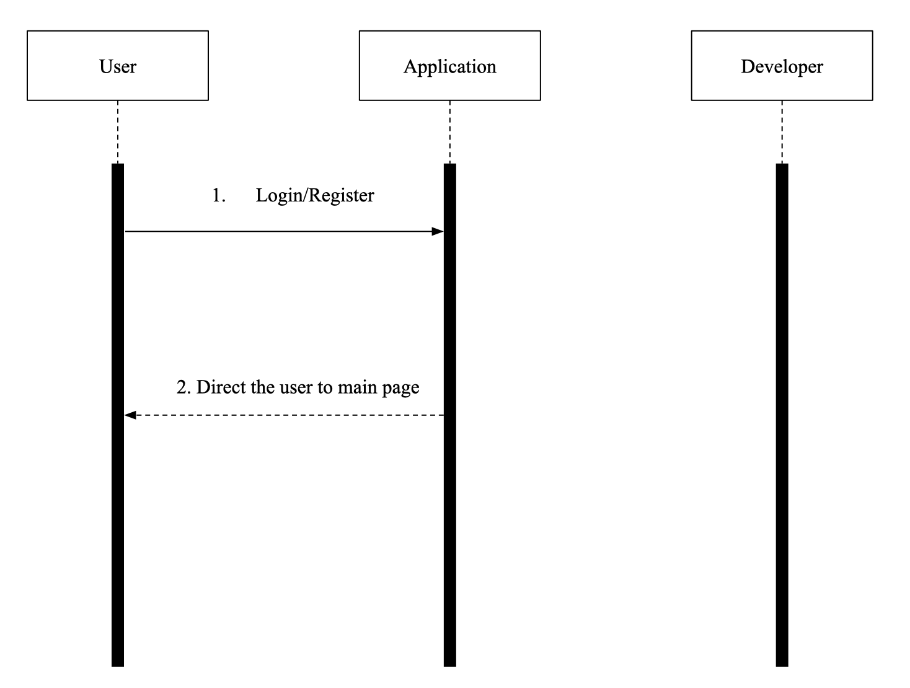
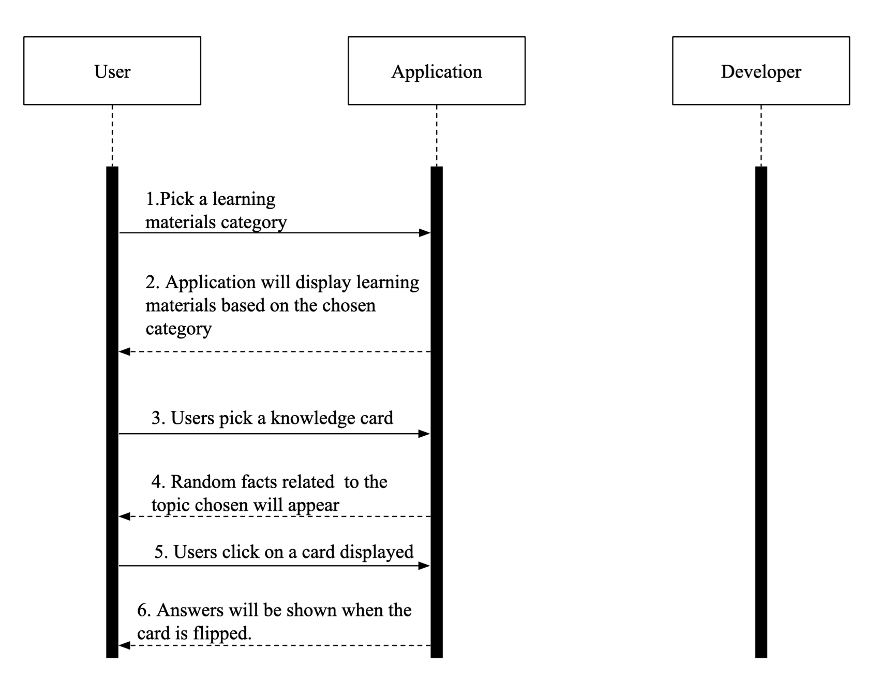

# :book:Education: myBelajar

## Group Members
No | Name | Matric No
:---: | --- | :---:
1 | Mohamad Aniq Fakhrul bin Mohamad Fauzi | 1728571
2 | Mohammad Lokman Bin Azmi | 1720191
3 | Muhamad Nor Zakwan Bin Ismail | 1726259
4 | Muhammad Luqman Bin Mohamad Nadzri | 1723099
5 | Nur Aida Afrina Binti Zulnazri | 1729832

## Introduction 
**myBelajar** is an interactive learning application that enables users to learn and gain knowledge with interesting questions and facts. **myBelajar** uses the concept of an answer card where, when the user presses on the card it will show a fact about that topic. Users can choose categories of knowledge that they want to know such as educational, sports, entertainment and many more. It is specially designed to attract people, especially children to learn more about interesting facts. Due to the pandemic of Covid-19, online learning has been a new norm for students, including teachers where we need to adapt to the online activities and classes. Therefore, **myBelajar** application can help teachers and students to learn additional knowledge as activities to make online learning more interactive and fun.

**myBelajar** application is targeted to users with access to smartphone and internet connection. Generally, we are targeted to people aged 12 years and above. **myBelajar** will be developed using React Native and Firebase as storage. _User Authentication_ will be handled by **Firebase Authentication** because of the security features implemented. Users' password wont be stored in plain-text but in encrypted format. In addition, application storage and database management will be handled and store in **Firebase Firestore**. 

## Objective
* To assist users in focusing, recognizing gaps in knowledge, building confidence, and assisting them in remembering information.
* To act as an alternative method in learning something that will profit the users of this application
* To motivate users to develop their memorizing skills, contribute in educational discussions, and do well in building general knowledge skills.

## Features and Functionalities
* **Signup Page** - Allow users to signup and access the dashboard
* **Login Page** - Allow users to login and access the dashboard
* **Dashboard Page** - Categorized various topics in cards
* **Facts Page** - Display facts card for selected topic
* **Profile Page** - Display user information

## Screen Navigation (routing) / Components Diagram

## Sequence Diagram

## References
* Why are Quizzes valuable in education? (n.d.). Retrieved April 24, 2021, from https://www.educationquizzes.com/knowledge-bank/why-are-quizzes-valuable-in-education/
* LMS, K. (n.d.). Advantages/benefits of online quiz: Online quiz creator. Retrieved April 24, 2021, from https://www.onlinequizcreator.com/knowledge-center/lms-knowledge-center/benefits-of-online-quiz/item289
